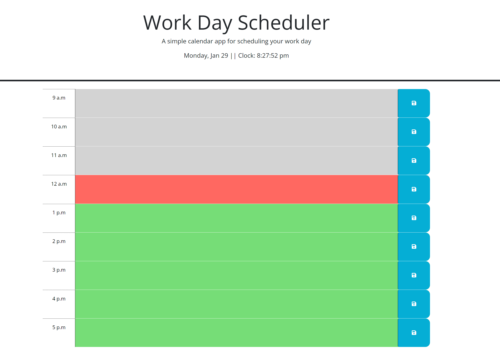

# Work-Day-Scheduler

Descritption:
A webpage that helps you to manage you'r schedule of the day, between Work Hours.

This application was designed to any worker to manage the task between the labor-day hours, it provides an internal dinamic clock to see the 'actual' time, and every time you refresh the webpage, the color of the textareas can change depending of the time (if it all ready pass, if it is the actual time, or if there has still not pass.), and, to use it, you need to simply open the provided URL: "https://bryangc96.github.io/Work-Day-Scheduler/"
, and click in the text area corresponding to the objective hour, you can write the task you want to complete in that time, and then press the "Save Icon" to the right side of the textarea.

By doing this, the content will be saved on the localstorage, for the user to manage however they prefer.

The application should look like this:

-Implemented by -BryanGC96.
